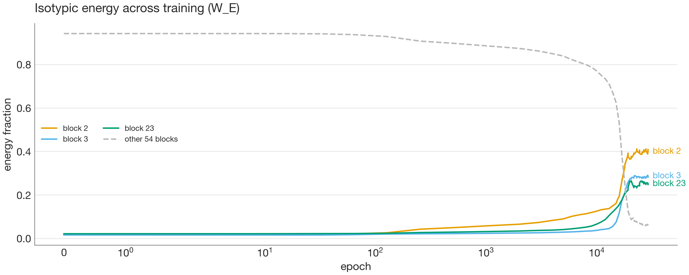
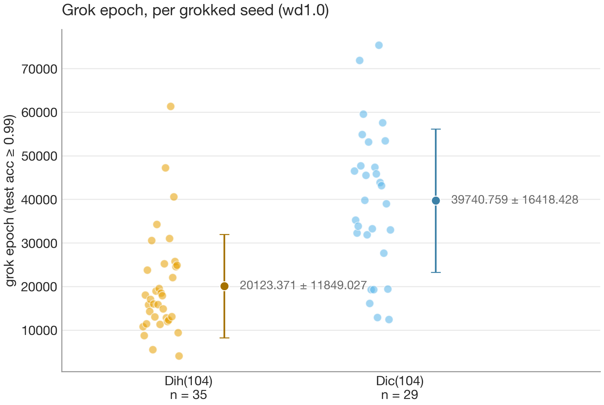

# finite-group-interp


**When a neural network learns a finite group operation, what algorithm is it actually implementing internally?**

A mechanistic interpretability research codebase: reproducible grokking experiments on finite-group multiplication, plus the representation-theory machinery needed to reverse-engineer what the trained networks compute.

---

## Repository structure

```
finite-group-interp/
├── src/finite_group_interp/
│   ├── groups/             # finite group algebra: construction, presentations, catalog
│   ├── representations/    # character tables, isotypic projectors
│   ├── model.py            # 1-layer transformer (from scratch, analysis-friendly)
│   ├── task.py             # group-multiplication task + train/test split
│   ├── training/           # trainer, config schemas, run manifests, logging
│   └── analysis/           # checkpoint loading, activation cache, irrep/coset metrics, evidence/verdict harness
├── scripts/                # run.py (training), analyze_run.py (irrep analysis)
├── reports/                # committed research write-ups
├── tests/                  # 250+ tests incl. mathematical property tests
└── runs/                   # local run artifacts (gitignored)
```

How data flows through the pipeline — every artifact traceable back to a config and a commit:

```
config (CLI dotlist → validated Pydantic schema)
   │
   ▼
scripts/run.py ── trainer ──► runs/<date>/<run_id>/
                                ├── manifest.json      provenance: git hash, config hash, env
                                ├── metrics.jsonl      training curves, every eval
                                └── checkpoints/*.pt   event-dense weight snapshots,
                                       │               full config embedded in each
                                       ▼
scripts/analyze_run.py ──────► runs/<run_id>/analysis/
                                ├── metrics.json       every reported number + provenance
                                └── figures/*.png ───► docs/figures/ ───► reports/*.md
                                                       (published)       (hand-written around
                                                                          generated artifacts)
```

---

## The research question

When a network learns to compose elements of a finite group, what algorithm and internal representation does it use, and how does that depend on the group's structure? This engages an open debate in the literature: do networks compose through the group's **irreducible representations** ([Chughtai et al., 2023](https://arxiv.org/abs/2302.03025)), or through **coset / subgroup structure** ([Stander et al., 2024](https://arxiv.org/abs/2312.06581))?

The published evidence on both sides is character-level: correlations between model internals and irreducible characters. Both hypotheses fit it. Neither paper varied the group to a regime where the two make divergent predictions. That is the gap this project was built to close.

### Findings

* **Groups of order < 20 do not generalise.** Across S₃, Q₈, A₄, C₈ × weight-decay sweeps (150k epochs), every model memorised the training set quickly and stayed at chance test accuracy. The dataset is the bottleneck (|G|² ≤ 361 examples), not optimisation — so small groups are learning a lookup table, not the group operation, and any "algorithm" read off them would be an artefact. The investigation therefore runs on groups of order ≈ 100–350.
* **The pipeline reproduces the canonical grokking result.** C₁₁₃ (modular addition) groks cleanly: train fraction 0.3, 30k epochs, 99.77% test accuracy, with dense checkpoints captured through the transition.
* **C₁₁₃ is calibration, not evidence in the debate.** 113 is prime, so C₁₁₃ has no proper subgroups: the coset hypothesis is vacuous here and cannot make a competing prediction. Replicating the known irrep signature on this run checks the measurement tools against an established answer. Only the same-character-table pairs below can adjudicate between the hypotheses.
* **The signature replicates, and it is causal.** Three isotypic blocks hold 94% of the embedding's energy (14–23× the random baseline); ablating any one costs 9–17 nats of test loss, while the other 53 blocks sit at a 0.05-nat noise floor; the model restricted to those three blocks keeps 97.4% accuracy. All of this was predicted in the [research log](docs/research-log.md) before the analysis ran. Full write-up: [the project page](https://brook-stefanou.github.io/projects/finite-group-interp/).



### The designed experiment: same-character-table pairs

Two non-isomorphic groups with identical character tables make character-level evidence — the entire class of evidence the debate currently rests on — mathematically incapable of telling them apart. Trained on such a pair, the hypotheses are forced apart:

| Pair | Order | Dataset size | What differs |
|---|---|---|---|
| Dih(104) vs Dic(104) **(run)** | 104 | 10,816 | 53 vs 1 involutions; Dih has 52 reflection subgroups while every subgroup of Dic contains its unique involution; 2-dim irreps real vs quaternionic |
| Heisenberg over F₅ vs C₂₅ ⋊ C₅ **(dim-5, unreached)** | 125 | 15,625 | element orders {1, 5} vs {1, 5, 25}; entirely different subgroup lattices — but the dim-5 group does not grok at the budgets tried, so this pair is parked |

That each pair shares a character table is not cited from the literature — it is computed and verified directly with the library's character-table machinery, and pinned by tests alongside the experiments.

Predictions, pre-registered before training: the coset hypothesis says learned-circuit statistics should track the (different) subgroup lattices; the matrix-level irrep hypothesis says structure should track the (different) irrep realisations — the real-vs-quaternionic contrast being its sharpest lever; a character-level-only account predicts no difference at all. That prediction even had a direction, and it turned out **wrong**: a real two-dimensional representation can be written entirely with real matrices, which carry fewer independent numbers than the complex matrices a quaternionic representation needs, so a network exploiting the real structure has fewer degrees of freedom to encode — predicting a *smaller* matrix-vs-trace gap for the dihedral group. The gap came out *larger* for it: a real signature, but in the opposite direction, and one I can't yet explain (see results below). The dihedral/dicyclic pair is the experiment this project ran end-to-end; neither group is a direct product, so the task does not factor. The order-125 pair (Heisenberg/F₅ vs C₂₅ ⋊ C₅) is the natural dimension-5 extension but is unreached: the dimension-5 group does not grok at the budgets tried, likely width-bound, so the matrix contrast there is parked.

The library builds all of these groups directly — the order-125 pair via the Todd–Coxeter presentation solver, Dih(104)/Dic(104) via the dihedral and dicyclic constructors, C₁₃ ⋊ C₈ via `semidirect_product` — so the limit on extending the comparison is compute and model capacity, not machinery.

### Results on the primary pair (Dih(104) vs Dic(104))

Across 138 seeds (weight decay 1.0; the matrix-level and coset contrasts taken on the 105 seeds where *both* groups grokked):



* **The pair separates on learnability.** Dih groks at 129/138 seeds (mean ~22k epochs, none stuck in memorisation — the nine misses are near-threshold at 0.88–0.99); Dic groks at 112/138, much later (mean ~40k), with 17 seeds stuck in pure memorisation (test accuracy < 0.5). The quaternionic group is reliably harder to learn, a sub-character difference, since the character tables are identical.
* **Cosets add nothing over irreps.** Coset-membership decodability, scored against the model's own kept irreps (the control both prior papers omit), has mean excess ≈ −0.05 across every proper normal subgroup and seed, zero or negative. The naive probe reaches 100%, but so does the irrep control, which is what exposes it as vacuous.
* **A matrix-level real-vs-quaternionic signature — in the unpredicted direction.** The matrix-vs-trace R² gap *does* separate the groups (Dih 0.063 vs Dic 0.038, Welch p = 0.0019 at n = 105, Dih larger on 70/105), where parameter-counting predicted the real group's gap should be the smaller one. The signature is real and directionally robust but modest, correlational, and currently unexplained.

On this pair, cosets add nothing over irreps, the readout carries an unpredicted representation-type signature, and the cleanest, most seed-stable discriminator is optimisation difficulty. All three findings replicate on a fully-connected baseline (31 seeds per group: Dih groks ~3× faster than Dic, the R²-gap separation is sharper at p = 0.0005, coset excess-over-irrep ≈ 0), so they are not transformer artefacts, and the coset-null holds on the very architecture the coset account was originally read from. Full write-up: [Irreps vs cosets on a same-character-table pair](https://brook-stefanou.github.io/projects/finite-group-interp/).

### Methods

Projections of embedding/attention weights onto isotypic (irreducible-representation) components via the projector library in `representations/`, coset/subgroup-alignment metrics scored against an irrep-restricted control, the matrix-vs-trace functional-form fit, per-component ablations, and SVD of weights across training checkpoints. A fully-connected baseline (shared embedding → one hidden ReLU layer) controls for architecture — the coset evidence in the literature is FC-based, the irrep evidence transformer-based; running the pair on both architectures shows all three findings hold regardless.

### Why this matters

The Chughtai/Stander disagreement is a clean instance of the central epistemic problem in mechanistic interpretability: two incompatible mechanistic explanations fitting the same evidence. If we cannot reliably adjudicate competing explanations in a one-layer transformer on a fully-characterised algebraic task — where the ground-truth structure can be computed exactly — claims about circuits in frontier models rest on weak foundations. This project treats the toy setting as a testbed for evidence standards: what measurements, controls, and ablations does it actually take to confirm one mechanism over another?

---

## Status

| | |
|---|---|
| Done | Group + representation-theory library, reproducible training pipeline, and per-run evidence/verdict harness; both experiments shipped with write-ups — C₁₁₃ calibration ([report 01](reports/01-c113-calibration.md)) and the Dih(104)/Dic(104) pair across 138 seeds with a fully-connected baseline ([report 02](reports/02-irreps-vs-cosets.md)); full synthesis on the [project page](https://brook-stefanou.github.io/projects/finite-group-interp/) |
| Possible extensions | Causal matrix-vs-trace ablation to test whether the representation-type signature is used; dim ≥ 3 dynamics (C₁₃⋊C₉, C₁₃⋊C₈ grok given enough data); the order-125 dim-5 regime is likely width-bound (Heisenberg/F₅ did not grok) and parked |

---

## Quick start

```bash
uv sync

# Reproduce the C113 grokking run (~10 min on CPU, deterministic) ...
uv run python scripts/run.py data.group=C113 data.train_frac=0.3 optim.epochs=30000

# ... then run the full irrep analysis on it (energy spectra, ablations, trajectory)
uv run python scripts/analyze_run.py runs/<date>/<run_id>

# ... or emit a typed, threshold-derived verdict for a single run
uv run python scripts/evaluate.py runs/<date>/<run_id>   # writes analysis/evidence.json

# Reproduce the same-character-table pair (one matched setting shown; sweep seeds for more)
uv run python scripts/run.py data.group=D52   data.train_frac=0.4 optim.weight_decay=1.0 optim.epochs=80000
uv run python scripts/run.py data.group=Dic26 data.train_frac=0.4 optim.weight_decay=1.0 optim.epochs=80000

# Cross-seed comparison: learnability + matrix-level + coset tiers
uv run python scripts/compare_pairs.py --coset runs/<date> [runs/<date> ...]

# Fully-connected baseline (architecture confound): same pair, FC instead of transformer
GROUPS=Dic26,D52 SEEDS=0-5 ARCH=fc uv run python scripts/sweep_parallel.py
uv run python scripts/pair_figures.py runs/<date> --arch fc --out docs/figures
```

Every run writes `manifest.json` (git hash, config hash, environment), `resolved_config.yaml`, `metrics.jsonl`, and weight checkpoints to `runs/<date>/<run_id>/`; the analysis adds `analysis/metrics.json` and figures. Any config field can be overridden with dotted CLI args, e.g. `data.train_frac=0.4 optim.weight_decay=1.0 experiment.seed=1`. (For a 5-second smoke test of the install, `data.group=C8 optim.epochs=200` works — but note the order-<20 finding above: groups that small memorise rather than generalise.)

---

## Reproducibility

The `training/` module is built so any reported number traces back to the exact run that produced it:
* **Validated configuration.** Pydantic schemas check every experiment parameter before the model is initialised.
* **Run manifests.** Each run records its Git hash, workspace state, and package versions, so a result can be reconstructed from its manifest.
* **Dual logging.** Scalar metrics are written concurrently to local JSONL files and to Weights & Biases.
* **Exception safety.** An unhandled exception is captured with its traceback and the run is marked failed, rather than failing silently.
