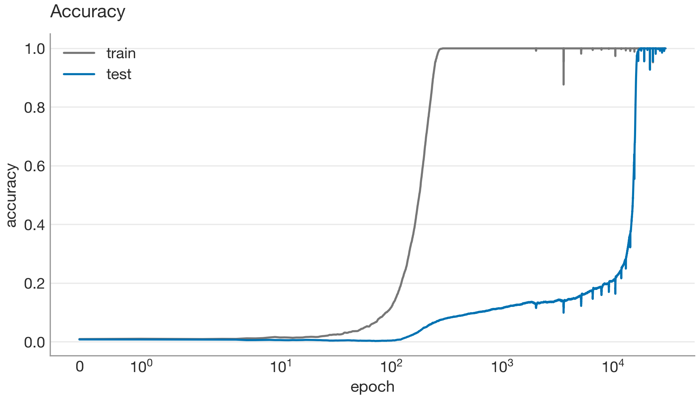
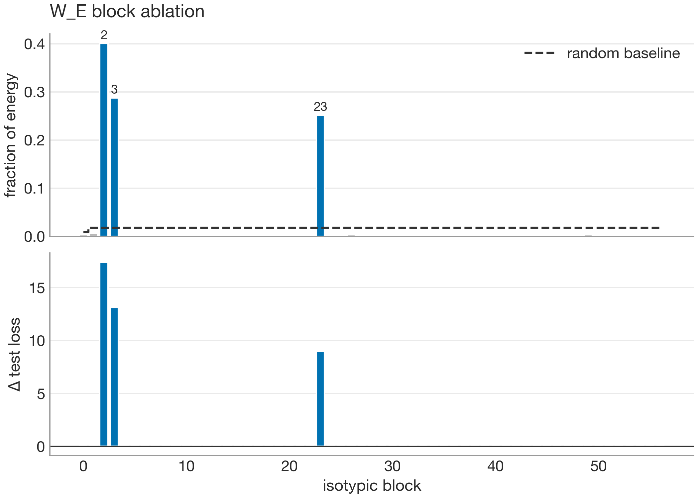
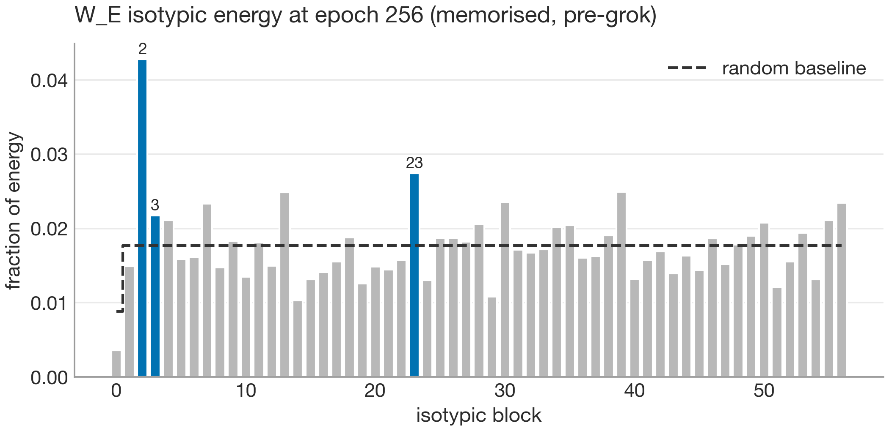
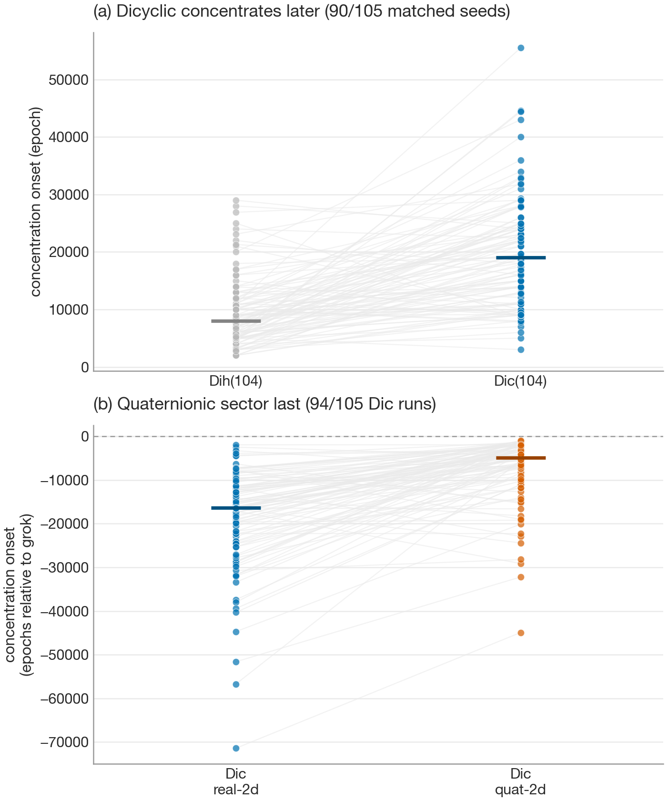
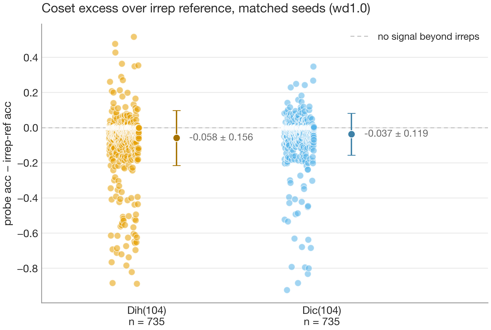
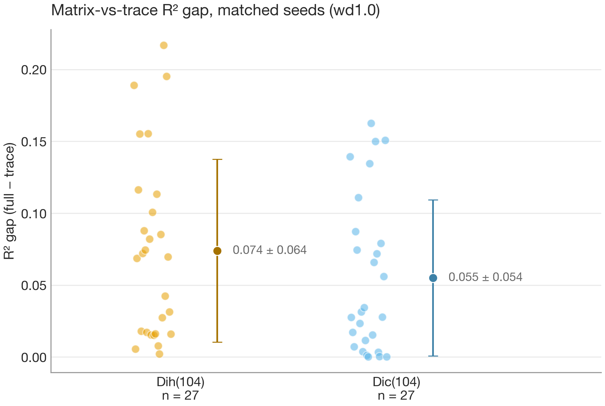
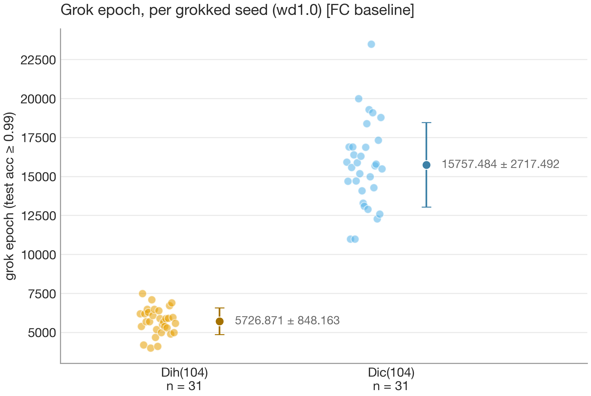
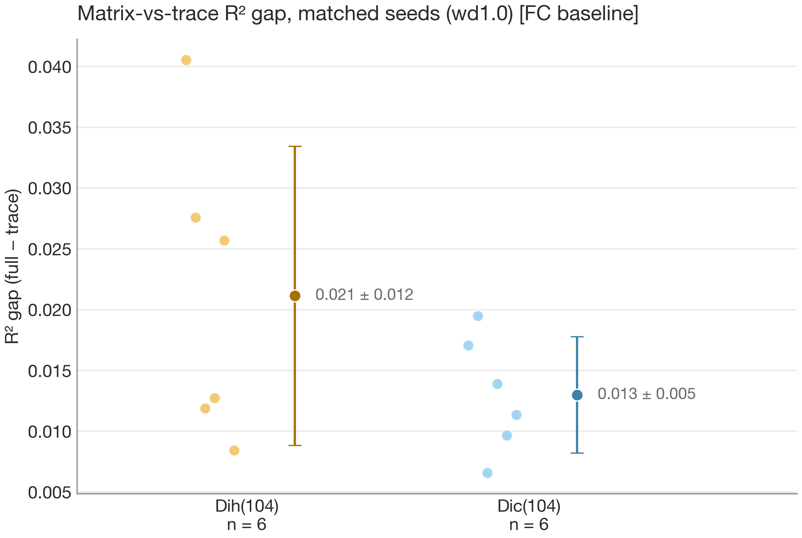

# How a network learns a finite group: irreps vs cosets, tested on a same-character-table pair

Small neural networks can be trained to multiply in a finite group. I found two competing hypotheses for how they generalise once they do. The first ([Chughtai, Chan & Nanda, 2023](https://arxiv.org/abs/2302.03025)) is that the network learns the group's irreducible representations and multiplies them, turning group composition into matrix multiplication. The second ([Stander et al., 2024](https://arxiv.org/abs/2312.06581)) is that it never multiplies anything. It works out which coset of each subgroup the answer falls into and intersects those constraints, in the style of the Chinese Remainder Theorem. The open question looked strangely testable, and coming from a pure maths background I already had the representation theory it needs. The discrete Fourier transform that Nanda found surprising in the modular-addition case is just the characters of a cyclic group, and recognising that was what made the question feel almost designed for me.

Here is what I found on a pair of non-isomorphic groups that share a character table, so any difference in how the model treats them has to come from structure the character table can't see. The coset account adds nothing the representations don't already account for. What separates the two groups is instead their representation type, real versus quaternionic. I can't fully settle the contest. The one clean discriminator came out in a direction I can't explain, and the converged-weight instruments are only correlational. But the case against a coset advantage is clean. This matters beyond the toy. That two incompatible mechanistic explanations can fit the same evidence is interpretability's central epistemic problem, and if it can't be settled on a one-layer transformer over a task whose ground truth we can compute exactly, claims about circuits in larger models rest on weaker ground than they look.

I don't expect the representation theory to be familiar to everyone, so I've collected the terms and the main facts I lean on in a glossary at the end.

## Getting to a testable question

Initially I wanted a kind of catalogue of how small transformer models learn group operations, across every group of order under 20. The models memorised the group operations quickly but they never generalised, and I think that's because there wasn't enough data to learn from. The dataset is every ordered pair of elements in the group, so its size grows like $|G|^2$, and even at order 20 that comes to only 400 pairs. Once you hold some of those back to test on, there's less still. For a task like this I quickly realised that wasn't enough to recover the whole group from examples.

The modular-addition results I was drawing on all sit around order 100, where there are thousands of pairs. The number of groups of order under 20 is only 49, against 1032 under order 100, and that count climbs fast with the order. So my question shifted from whether the models generalise to what they learn when they do.

The reason the two hypotheses can't be separated on a cyclic group is that all of its irreducible representations are one-dimensional. The representation-theory account predicts the network correlates with the group's characters and for a one-dimensional representation the trace is the whole matrix (a $1 \times 1$ matrix is just its single entry). The coset account isn't phrased in terms of characters at all, but Stander et al. showed that the same character correlation also follows from coset-counting, so observing it is evidence for neither account over the other. A cyclic group only has one-dimensional irreducible representations so there is no way to break the tie.

To remove characters as a factor I chose groups that have some irreducible representations of dimension greater than one, so that there was sub-character structure for the model to learn. On these groups the characters can't tell apart elements in the same conjugacy class, so the model can't read off a product from characters alone, and generalising to the test data at all is itself evidence that it has learned some sub-character structure. Since character tables don't uniquely determine a group, I picked two that share one, the dihedral group $D_{52}$ and the dicyclic group $\mathrm{Dic}_{26}$, both of order 104. Any character-level measurement sees the two as the same group, so if the model treats them differently the difference has to come from below the character table.

The two groups have different subgroup lattices, and their two-dimensional representations are of a different type. The dihedral group has many reflection subgroups, while the dicyclic group has a single involution and a sparser, quaternion-like lattice. Their two-dimensional irreducible representations differ in that the dihedral group's can be written with real matrices while the dicyclic group's cannot. The first of these is what the coset account should be sensitive to, and the second is the kind of thing the irreducible-representation account should see.

| | $D_{52}$ (dihedral) | $\mathrm{Dic}_{26}$ (dicyclic) |
|---|---|---|
| Order | 104 | 104 |
| Irreducible representations | 29 (4 one-dim, 25 two-dim) | 29 (4 one-dim, 25 two-dim) |
| Character table | shared | shared |
| Subgroups of order 2 | 53 | 1 |
| Two-dimensional irrep type | all 25 real | 12 real, 13 quaternionic |

*Everything the character table fixes is identical (the top three rows). The groups differ only below it. The dihedral group's 53 subgroups of order two are its reflections, against the dicyclic group's single involution. And its two-dimensional irreducible representations are all real, where 13 of the dicyclic group's are quaternionic, the axis the headline results turn on.*

## Summary

I trained the same model on the two groups and applied the instruments. An energy instrument locates which irreducible representations the model concentrates in. The two converged-weight measurements I compare the groups on (coset decodability and the matrix-versus-trace gap) are read against that set, and a third measurement tracks how training unfolds. The clearest difference turned out to be in how hard each group is to learn (the epoch at which it stops memorising and generalises), not in anything I could read off the converged weights. Of the two, the coset one came back null, while the matrix-versus-trace gap did separate the two groups.

- **The two groups separate on learnability.** The dicyclic group is reliably slower to generalise than the character-identical dihedral group, and often stays stuck memorising. The dihedral group generalised on 129 of 138 seeds, the dicyclic on 112, with 17 of the dicyclic failures never leaving memorisation. The lag is rep-theoretic. The dicyclic group's quaternionic blocks are the last structure to concentrate, tying the gap to the same real-versus-quaternionic axis as the matrix signature below.
- **The coset account adds nothing over the irreducible representations.** Measured against a control restricted to the irreducible representations the model actually uses, coset decodability sits at or below zero on every proper normal subgroup (averaging $-0.058$ for the dihedral group and $-0.037$ for the dicyclic), so the coset signal is already accounted for by the irreducible representations.
- **There is a matrix-level signature that separates the two groups.** The matrix-versus-trace gap is larger for the real dihedral group than for the quaternionic dicyclic one (0.063 vs 0.038, Welch p = 0.0019 across 105 matched seeds, dihedral larger on 70 of them). It is a real difference, but in the opposite direction to what I had predicted, and one I can't yet explain.

What ties these together is representation type. The learnability gap and the matrix-level signature both key on the same real-versus-quaternionic distinction, one a fact about training dynamics and the other about the converged weights. That one axis doing double duty is the part I find most suggestive, even if I can't yet explain the direction of the matrix effect.

I'm confident in the empirical results on this one pair, and all three replicate on a fully-connected baseline, so they aren't artefacts of the transformer. Whether they generalise to other pairs is open.

## Calibrating on C113

Before trusting the instruments on a contested case, I ran them on one where the answer is already known, the cyclic group of order 113 (the setup from Nanda et al.). This isn't evidence for either account since 113 is prime, so the group has no proper subgroups and the coset account has nothing to predict. The point was only to check that the tools report the truth in a case where it has already been established. The model memorises quickly and then generalises at around 15,000 epochs, reaching 99.77% test accuracy.

*Grokking on C113. Train accuracy (grey) reaches 100% within a few hundred epochs while test accuracy (blue) stays near zero, then generalises in a sharp jump at around 15,000 epochs. This long delay between fitting the training data and generalising is the grokking phenomenon the rest of the post relies on.*

The energy instrument finds where the learned structure sits. Each column of the embedding is a function on the group, and that space splits into isotypic blocks, one per irreducible representation. After the model generalises, three of these blocks hold 94% of the embedding's energy, at 14 to 23 times the random-matrix baseline, and every other block sits below baseline. The concentration is causal, not incidental. Ablating any one of the three blocks costs between 9 and 17 nats of test loss, while ablating any other block costs at most 0.05. When restricted to just those three blocks the model keeps 97% test accuracy also. This reproduces the modular-addition result on my own implementation. I built the instrument from the character table rather than tuning it to the cyclic group so the same code runs unchanged on the non-abelian groups later. On those groups it does double duty: the high-energy blocks it picks out are the set of irreps the coset and matrix-versus-trace instruments are then measured against.

*C113 calibration. The top panel shows the fraction of embedding energy in each isotypic block against the random-matrix baseline, with three blocks dominating. The bottom panel shows the test-loss cost of ablating each block. Energy and causal importance pick out the same three blocks.*

At a memorised checkpoint, before the model generalises, the same spectrum is close to uniform across the blocks. That is what a lookup table with no preferred structure looks like, and it is the signature the instrument should report when the network has not yet found the algorithm. Even here one block already sits slightly above the rest, and it is one of the three that later hold almost all the energy.

*The same per-block energy at a memorised checkpoint, before generalisation. It is close to uniform across blocks, so memorisation leaves no preferred structure for the instrument to find.*

The functional-form fit works out what function the network computes, by regressing the logits onto the feature $\rho(a)\rho(b)\rho(c)^{-1}$, which is the identity exactly when $c = ab$ since $\rho$ is a group homomorphism. I report the fit as an $R^2$, the share of the logits' variance the feature reconstructs.

On C113 the matrix-level fit and the trace-only fit are identical with their gap exactly zero. Since the irreducible representations of C113 are one-dimensional the matrix carries nothing beyond its trace. The instrument is meant to detect sub-character structure correctly and report none when none can exist, so the zero result is what I wanted to see before trusting the instrument on two-dimensional representations.

The homomorphism feature explains only about 55% of the logits, not the 90%-plus I'd predicted in advance. The network does however compute the group operation, with 98% of the logit variance a function of $(a+b, c)$, so it reads $a$ and $b$ almost entirely through their sum. The residual isn't random noise either since about 90% of it lands on just 18 components out of 12,769, and those sit at multiples of the frequency the model already uses, so they look like harmonics rather than the spread-out signal a lookup table would leave.

## Setup

To learn the group operation the model is given a pair of elements $(a, b)$ and predicts the product $a \cdot b$. It sees every one of the $|G|^2$ ordered pairs, trains on a fixed fraction of them, and is tested on the rest. A single seed fixes both the train/test split and the initialisation, so a seed below means one draw of both together.

The model is a one-layer transformer, with an embedding, a single attention block with four heads, an MLP, and an unembedding. The model has no LayerNorm, no biases, and untied embeddings, kept deliberately minimal so the analysis can read the representation-theoretic structure straight off the weights. Weight decay is the ingredient that drives generalisation, as in the rest of the grokking literature.

The two groups were compared at a matched seed and weight decay. Learnability is measured across all 138 seeds, while the two instruments on the converged weights use only the 105 seeds where both groups generalised. One is the matrix-versus-trace $R^2$ gap, which tests whether the readout uses matrix structure beyond the character, and is where the irreducible-representation account would show up. The other is coset decodability in excess of a control built from the irreducible representations, which tests whether there is a coset signal the representations don't already provide, and is where the coset account would show up.

## Result 1: learnability

The clearest difference between the two groups needs no analysis of the trained weights. At weight decay 1.0 the dihedral group generalised on 129 of 138 seeds in around 22,000 epochs (median 18,500). The dicyclic group managed 112 of 138 and took around 40,000 epochs (median 37,700), roughly twice as long. It also only generalised at this larger weight decay. At weight decay 0.5 the dihedral group still got there and the dicyclic group never did. The way the two failed also differed. The nine dihedral misses came close, reaching final test accuracy between 0.88 and 0.99 with none stuck in memorisation. Seventeen of the 26 dicyclic misses never left memorisation at all. The lowest reached only 0.02 test accuracy.

The two groups have the same character table, so this difference is sub-character. It lives in how the models train, not in the weights they converge to. Neither account predicts it, since both describe the converged circuit and not how long it takes to reach.

*Epoch of generalisation by group across 138 seeds at weight decay 1.0. The dihedral group generalises early and at nearly every seed. The dicyclic group is about twice as slow, and 26 of 138 do not generalise at all, 17 of them stuck in memorisation.*

The trained weights don't explain the gap, but the trajectory does. Running the same energy instrument across the training checkpoints, with the isotypic blocks split by representation type, shows the dicyclic group concentrating its energy later than the dihedral on 90 of the 105 matched seeds, by a median per-seed gap of about 8,600 epochs.

The lag has a rep-theoretic location. Within each dicyclic run, holding the seed and optimiser fixed, the real two-dimensional blocks lock in early, well before the model groks, while the quaternionic blocks are the last structure to form, concentrating at or after the real ones on 94 of 105 seeds, a median of about 10,500 epochs later, right up against the grok point.

So the slow step looks like building the quaternionic blocks, and the dicyclic group has thirteen of those where the dihedral has none. That ties the learnability gap to the same real-versus-quaternionic axis the matrix-versus-trace gap turns on. Like the rest it is correlational: it shows when each block concentrates, not that forming the quaternionic blocks is what holds training up.

*Energy-concentration onset (the epoch reaching half the final energy above uniform) across the 105 matched seeds. Top: the dicyclic group concentrates later than the dihedral on 90 of 105 matched seeds, by a median per-seed gap of about 8,600 epochs, grey lines pairing each seed. Bottom: within each dicyclic run, relative to its grok point, the real two-dimensional sector locks in well before grokking while the quaternionic sector concentrates at or after it on 94 of 105 seeds, the last structure to form.*

## Result 2: cosets add nothing over the irreducible representations

From the residual stream, a linear probe tries to read which coset of each proper normal subgroup the product $ab$ falls into. On its own it often reaches 100%.

A high probe accuracy doesn't show a coset mechanism, because the irreducible representations the model already uses can support the same readout. The probes are scored against two controls, a random-partition null for a capacity floor and a reference built only from the irreducible representations the model concentrates in. That set is small and the same shape for both groups. The embedding splits into 29 isotypic blocks, and the model keeps about four or five of them (the blocks above twice the random-matrix baseline), holding around 80% of its energy, the same few-block concentration C113 showed. A classic representation theory result is Peter-Weyl, which states that every function from the group to $\mathbb{C}$ can be built from the matrix entries of all the irreducible representations, and the indicator function on coset membership is one of these. A control using all of them would therefore reconstruct the cosets trivially, so restricting it to the representations the model actually uses is what makes it meaningful. This reference is subtracted from the probe's accuracy. If that difference is at or below zero, the coset-membership information is already contained in the irreducible representations the model has learned. If it is above zero, there is coset information those representations do not account for.

Across all seven proper normal subgroups, and across the 105 seeds where both groups generalised, the difference is at or below zero for both groups, with means of $-0.058$ for the dihedral group and $-0.037$ for the dicyclic. Where the probe reaches 100% the irreducible-representation reference reaches 100% too, so the difference there is zero. This instrument does not separate the two groups. A causal ablation would add nothing here, since the excess already measures whether coset membership is decodable beyond the representations the model uses, and at or below zero there is nothing outside them to ablate.

*Coset decodability minus the irreducible-representation reference, for target $ab$ over the seven proper normal subgroups across 105 seeds. The values cluster at or below zero for both groups, so the probe's success is explained by the representations the model already uses.*

## Result 3: the matrix-versus-trace $R^2$ gap

The matrix-versus-trace $R^2$ gap is the share of the logit variance that the full representation matrices explain beyond what the character alone explains. I expected the two groups to differ on it since a real two-dimensional representation can be written entirely with real-number matrices, whereas a quaternionic one cannot and needs complex entries. A real matrix has fewer independent numbers in it than a complex one, so a network exploiting the real structure has fewer degrees of freedom to encode than one stuck with the complex structure. If the network multiplies representation matrices, the real dihedral group and the quaternionic dicyclic group should leave different fingerprints in how it combines them, and this gap is built to find them.

At 105 matched seeds the gap does separate them. The dihedral mean is 0.063 ($\pm$ 0.061, median 0.043) and the dicyclic 0.038 ($\pm$ 0.050, median 0.014), a Welch t-test giving p = 0.0019. The dihedral gap is the larger of the pair on 70 of the 105 seeds (sign test p = 0.0008), and the paired difference is +0.024 with a 95% bootstrap interval of [+0.009, +0.039]. The effect is modest and the distributions are right-skewed, so the mean separation leans on a tail of high-gap dihedral seeds. But the direction is consistent across seeds, and it is not explained by the dihedral group grokking sooner.

The gap is positive for both groups, so the network does use matrix structure beyond the character, which any model that generalises needs, so the discriminating part is not its presence but that its size differs by representation type. I had expected the two to differ, but my reasoning ran the other way. A real representation needs fewer independent numbers than a quaternionic one, which if anything predicts a smaller dihedral gap. It came out larger, and I don't have a representation-theory explanation for the direction. The instrument is also only correlational: it shows the structure is decodable, not that the network uses it.

*Matrix-versus-trace $R^2$ gap by group across the 105 matched seeds. The dihedral gap is larger than the dicyclic (means 0.063 and 0.038, larger on 70 of 105 seeds), so the gap distinguishes the groups (Welch p = 0.0019), though both distributions are right-skewed and overlap.*

## A fully-connected baseline

Everything so far uses a transformer architecture, but the coset account ([Stander et al., 2024](https://arxiv.org/abs/2312.06581)) comes from a one-hidden-layer fully-connected network. So a transformer-only result leaves the architecture itself as a confound. The learnability split or the coset null could be a property of attention itself, with nothing to do with the groups. To check, I retrained the pair on a one-hidden-layer fully-connected network, a shared embedding of $a$ and $b$ concatenated into a single ReLU layer with no biases, 31 seeds per group at weight decay 1.0.

The learnability split holds and is sharper. The dihedral group generalises in about 5,700 epochs and the dicyclic in about 15,800, roughly three times slower, the same ordering as the transformer. On the fully-connected network every dicyclic seed eventually generalises, so the memorisation plateau that struck 17 of the 138 transformer runs is a transformer-specific failure mode, not a fact about the group. Here the asymmetry is a difference in speed.

The other two findings replicate as well, and the matrix gap separates the groups more cleanly here than on the transformer. The matrix-versus-trace $R^2$ gap is larger for the dihedral group in the same direction, with means of 0.021 ($\pm$ 0.011) and 0.012 ($\pm$ 0.006) and the dihedral gap larger on 25 of the 31 seeds (Welch p = 0.0005). The magnitudes are smaller than on the transformer but the separation is tighter. And cosets again add nothing over the representations. Mean excess is +0.019 for the dihedral group (95% bootstrap interval [$-0.000$, +0.040]) and $-0.016$ for the dicyclic ([$-0.032$, +0.002]), neither distinguishable from zero (one-sample $p = 0.07$ each, the excess positive on 18 of 31 dihedral seeds and 8 of 31 dicyclic). This is also the fully-connected architecture the coset account was originally built on, so if a coset signal beyond the representations were going to appear anywhere, it would be here, and the dihedral interval only barely includes zero, so this is the one place a larger fully-connected run could still turn one up.

*Epoch of generalisation by group on the fully-connected baseline, 31 seeds each. The dihedral group generalises about three times faster than the dicyclic, the same ordering as on the transformer.*

*Matrix-versus-trace $R^2$ gap on the fully-connected baseline across 31 matched seeds. The dihedral gap is larger than the dicyclic (0.021 vs 0.012, larger on 25 of 31 seeds), separating the groups more tightly than on the transformer (Welch p = 0.0005).*

## Extending to larger irreducible representations

The two groups in the pair both have irreducible representations of dimension at most two, which is where the matrix-versus-trace gap has the least room to show anything. A preliminary sweep covered two groups with larger representations, $C_{13} \rtimes C_9$ (order 117, irreducible representations up to dimension three) and $C_{13} \rtimes C_8$ (order 104, up to dimension four). It suggests both still generalise once they are trained on enough of the multiplication table, reliably at higher training fractions and not at lower ones, with weight decay mattering little. These runs are too few to pin down the boundary, so I leave the dynamics at larger representation dimensions to follow-up work.

Past a point, width itself becomes the limit. In the regular representation an irreducible representation of dimension $d$ appears $d$ times, so it occupies a block of dimension $d^2$. A five-dimensional irreducible representation therefore needs 25 of the model's dimensions, and a 64-wide residual has room for only a couple of such blocks. Reaching the largest representations would need a wider model than the 64 dimensions used here.

## What this does and doesn't settle

There are real limits to what one matched pair can show. The two converged-weight instruments are correlational. They show what structure is present and linearly decodable in the trained network, not what the network actually uses to work out the product.

This rules out a coset advantage. Measured against the irreducible representations the model concentrates in, coset membership adds nothing beyond them, and this holds on the fully-connected network the coset account came from as well as on the transformer. It does not, though, settle the contest for the representation account. Any model that generalises has to separate elements inside a conjugacy class, which the character cannot do, so both accounts require sub-character structure and the bare matrix-versus-trace gap is not by itself evidence for either.

The one discriminating signal is that the size of the gap tracks representation type, larger for the real dihedral group than the quaternionic dicyclic one, which the coset account has no reason to predict. Since I can't explain its direction (Result 3), I treat it as an open thread, not a verdict. And the positive claim the representation account makes, that the network multiplies representation matrices, I have not shown.

The matrix-versus-trace gap, the one instrument that separates the groups, is a modest effect, not a weak one. It is statistically clear. Welch p = 0.0019 on the transformer and p = 0.0005 on the fully-connected baseline. The dihedral side is larger on 70 of the 105 matched seeds, so the direction does not rest on a few outliers. The size of the separation is less stable, since the gaps are right-skewed. Dropping the five largest dihedral seeds still leaves it significant; dropping ten does not.

The two accounts can't be separated causally either. The natural test would be to ablate the 48 dimensions of representation structure that no coset membership can express and see whether the model breaks. On these models it can't be done, for a reason I can be exact about. Coset membership over the seven proper normal subgroups already spans a 56-dimensional slice of the group's 104-dimensional function space, and the directions a probe uses to separate those cosets can occupy as many as 89, more than a 64-wide residual has to give. So the coset-separating directions fill the residual completely, their orthogonal complement zero to floating-point precision on every seed I checked, and nothing is left orthogonal to ablate.

A wider model has room: at four times the width the coset subspace reaches rank 96 of 256 and leaves a genuine complement, so the ablation that is degenerate here becomes possible. That is the obvious way to come back to this, and where I leave it.

The most robust finding, learnability, sits to one side of the question this was built to settle: neither account predicts how long training takes. Preliminary wider runs hint even this may be capacity-specific (at four times the width the dicyclic group grokked about as fast as the dihedral), though on only four seeds a side, so I read it as a flag on the headline, not a retraction. The external-validity worries are otherwise the usual ones. This is one pair, so it may reflect something about these two groups rather than the real-versus-quaternionic distinction in general. Whether any of the discriminating instruments would say something sharper on a wider model, or on a second matched pair, is the next question.

## Methods

**Model and training.** The configuration the results depend on; the remaining hyperparameters (learning rate, initialisation scale, head count, MLP width) are in the code.

- One-layer transformer with $d_\text{model} = 64$. The fully-connected baseline shares the same embedding, concatenates $a$ and $b$, and passes them through a single ReLU hidden layer with no biases.
- Inputs are the sequence $(a, b, =)$ over a vocabulary of the $|G|$ group elements plus the $=$ symbol; the prediction is read at the final, $=$, position.
- Full-batch training over all $|G|^2$ pairs, with the matched pair at train fraction 0.4.
- AdamW for 80,000 epochs. Weight decay is the grokking lever, set to 1.0 for the matched pair; $\beta_2$ is lowered to 0.98 from the usual 0.999 to damp loss spikes.
- Training is deterministic on CPU, and weights are snapshotted on an event schedule so the epoch of generalisation can be timed.

**Isotypic energy and ablation.** Each column of the embedding is a function on the group, and that space decomposes into one isotypic block per irreducible representation. I measure the fraction of the embedding's energy in each block against a random-matrix baseline, and the causal importance of each block by ablating it and measuring the test-loss cost. The decomposition is built from the character table, so the same code runs unchanged on every group.

**Functional-form fit.** To find what function the network computes, I regress the logits onto the feature $\rho(a)\rho(b)\rho(c)^{-1}$, which equals the identity exactly when $c = ab$ because $\rho$ is a homomorphism, and report the fit as an $R^2$. The matrix-versus-trace gap is the difference between fitting the full representation matrices and fitting only their traces (the characters); it is the share of logit variance explained by matrix structure beyond the character. The representation matrices are extracted numerically from the regular representation by the commutant method (built from the matrices that commute with the regular representation), which handles dimensions above one where picking a single generic vector does not.

**Coset probe.** From the residual stream a logistic-regression probe (fit with LBFGS) reads which coset of a given proper normal subgroup the product $ab$ falls into. It is scored against two controls, a random-partition null for a capacity floor and a reference built only from the irreducible representations the model concentrates in. An all-irreducible reference would be vacuous, since by Peter-Weyl every function on the group, coset membership included, is reconstructible from the full set, so restricting it to the representations the model actually uses is what makes the excess meaningful.

**Statistics.** Group-level differences in the matrix-versus-trace gap are tested with a Welch t-test. The matched contrasts (matrix gap and coset excess) use only the seeds where both groups generalised.

## Glossary

**Subgroup lattice.** The collection of all subgroups of a group, partially ordered by inclusion. It forms a lattice, since any two subgroups have a greatest lower bound, their intersection, and a least upper bound, the subgroup they generate together. How many subgroups there are and how they nest is a structural invariant of the group.

**Normal subgroup.** A subgroup $N \le G$ preserved by conjugation: $gNg^{-1} = N$ for every $g \in G$. Its left and right cosets then coincide, so the cosets themselves form a group, the quotient $G/N$. Normality is what makes "which coset of $N$ does $ab$ fall into" a well-defined group-valued function of the product.

**Coset.** For a subgroup $H \le G$ and an element $g$, the left coset $gH = \{gh : h \in H\}$ is the translate of $H$ by $g$. The cosets partition $G$ into blocks all of size $|H|$, and coset membership labels which block an element lands in. When $H$ is normal these blocks are the elements of the quotient $G/H$.

**Conjugacy class.** The orbit of an element $x$ under conjugation, $\{gxg^{-1} : g \in G\}$. The group partitions into conjugacy classes, and a character is constant on each, so no character-level measurement can tell apart two elements in the same class.

**Representation.** A group homomorphism $\rho \colon G \to GL_n(\mathbb{C})$, a map sending each group element to an invertible $n \times n$ matrix such that $\rho(ab) = \rho(a)\rho(b)$ for all $a, b \in G$. Equivalently, an action of $G$ on an $n$-dimensional vector space by invertible linear maps. The integer $n$ is the dimension of the representation.

**Irreducible representation.** A representation with no proper nonzero subspace invariant under every $\rho(g)$. Over $\mathbb{C}$, every representation of a finite group decomposes as a direct sum of irreducible representations.

**Character.** The function $\chi \colon G \to \mathbb{C}$ given by $\chi(g) = \operatorname{tr}\rho(g)$. It is constant on conjugacy classes, and over $\mathbb{C}$ it determines a representation up to isomorphism. For a one-dimensional representation $\rho(g)$ is a scalar equal to its own trace, so the character carries the whole representation; in higher dimensions it retains only the trace.

**Character table.** The square array of character values, one row per irreducible representation and one column per conjugacy class. It does not determine a group up to isomorphism, since non-isomorphic groups can share a character table.

**Real, complex, and quaternionic representations.** The classification of a complex irreducible representation by its Frobenius-Schur indicator into real ($+1$), complex ($0$), or quaternionic ($-1$) type, according to whether it admits an invariant symmetric bilinear form, no invariant bilinear form, or an invariant alternating form. A real-type representation can be realised over $\mathbb{R}$; a quaternionic one cannot.

**Regular representation.** The action of $G$ on the vector space $\mathbb{C}[G]$, which has one basis vector $e_h$ for each group element, with $g$ acting by $e_h \mapsto e_{gh}$. In this basis every group element is a permutation matrix. It contains every irreducible representation, each occurring a number of times (its multiplicity) equal to that representation's own dimension. So an irreducible of dimension $d$ occurs $d$ times, and as each copy is itself $d$-dimensional those copies together span $d \times d = d^2$ dimensions; summed over all the irreducible representations this gives $\sum_i d_i^2 = |G|$.

**Isotypic block.** Within any representation, the isotypic block of an irreducible representation $V$ is the sum of all the copies of $V$ that the representation contains, so for multiplicity $m$ and dimension $d$ it has dimension $md$. A representation is the direct sum of its isotypic blocks, one for each irreducible representation that occurs in it. The $d^2$-dimensional blocks of the regular representation are the case $m = d$.

**Peter-Weyl theorem.** For a finite (or compact) group, the matrix entries of the irreducible representations form a basis for the space of functions on the group; equivalently $\mathbb{C}[G] \cong \bigoplus_i \operatorname{End}(V_i)$, the sum running over the irreducible representations $V_i$.
