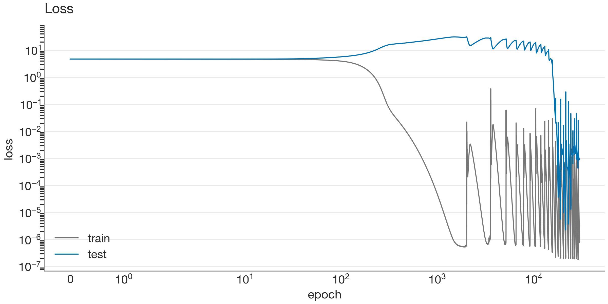

# Calibrating irrep instruments on a known answer: a grokked C₁₁₃ transformer

> **Run:** `2026-06-04_050749_grok-C113` (training commit `99392b9`) · **Checkpoint analysed:** `step_29158` · **All numbers:** `runs/2026-06-04/2026-06-04_050749_grok-C113/analysis/metrics.json` · **Analysis code:** [`analysis/`](../src/finite_group_interp/analysis/)

The expectations for this analysis were written in the research log before the analysis code existed; this report is the comparison of those predictions against the measurements.

## Summary

A 1-layer transformer trained on C₁₁₃ multiplication (modular addition) groks at ~epoch 15,000. After grokking, **three of the 56 frequency blocks hold 94.0% of the embedding's energy** (22.6×, 16.2×, and 14.2× the random baseline). The concentration is causal, not just observational: ablating any one of those blocks costs **9.0–17.4 nats** of test loss, ablating any of the other 53 costs at most **0.047**, and a model restricted to *only* the three blocks retains **97.4% test accuracy**. Energy concentration rises exactly at the grokking transition.

This replicates the known Fourier sparsity result for modular addition on an independent stack, using isotypic projectors derived from the group's character table rather than hardcoded Fourier features — which is the point: the same code now runs unchanged on the non-abelian same-character-table pairs where the real experiment lives.

## The question, and why this group cannot answer it

When a network learns to compose group elements, two incompatible mechanistic accounts fit the published evidence: composition via the group's irreducible representations ([Chughtai et al., 2023](https://arxiv.org/abs/2302.03025)) and composition via coset/subgroup structure ([Stander et al., 2024](https://arxiv.org/abs/2312.06581)). Both bodies of evidence are character-level — correlations between model internals and irreducible characters — and character-level evidence cannot separate the two accounts.

C₁₁₃ is deliberately *not* an attempt to answer that question. 113 is prime, so C₁₁₃ has no proper subgroups: the coset hypothesis is vacuous here by construction and cannot make a competing prediction. What this run can do is **calibrate the measurement instruments against a known answer** — the Fourier sparsity result of [Nanda et al. (2023)](https://arxiv.org/abs/2301.05217) — so that when the same instruments are pointed at Dih(104) vs Dic(104), a disagreement between them is evidence about the model rather than about the tools.

## Setup

- **Task:** predict a·b from the pair (a, b), all 113² = 12,769 pairs, train fraction 0.3 (3,831 training examples), split seed = experiment seed 0.
- **Model:** 1-layer transformer, d_model 64, 4 heads, d_mlp 256, ReLU; no LayerNorm, no biases, untied embed/unembed (the [Nanda architecture](https://arxiv.org/abs/2301.05217)). Weight names follow the TransformerLens convention so the state_dict doubles as the analysis contract.
- **Training:** full-batch AdamW, lr 10⁻³, β = (0.9, 0.98), weight decay 1.0, 30k epochs, deterministic CPU.
- **Reproducibility:** every run writes a manifest (git hash, config hash, environment); checkpoints embed the full config, so any snapshot reconstructs its model exactly. 289 snapshots were taken, dense around training events.

## Preregistered expectations

Recorded in the [research log](../docs/research-log.md) (Jun 7) before the analysis ran:

> - Energy concentrates in a small arbitrary set of frequency pairs (~4–6, which ones are seed lottery), near zero in the trivial block.
> - Why several frequencies and not one: logits ≈ Σₖ cos(k(a+b−c)), so used frequencies add coherently at c = a+b and cancel elsewhere — more frequencies sharpen the peak and lower the loss, while weight decay prices each one; the balance lands at a handful.
> - Falsification arm: a memorising network would smear energy near-uniformly across all 56 pairs.


## Results

### The model groks


Train accuracy reaches 1.0 by epoch ~300; test accuracy stays near chance (1/113 ≈ 0.9%) for another ~15,000 epochs, then jumps to ~1.0. Final test accuracy at the analysed checkpoint: **99.77%** (test loss 0.0084).



The periodic spikes after train loss reaches its floor (~10⁻⁶) are the "slingshot" instability of adaptive optimizers: near-zero gradients shrink AdamW's second-moment estimate, inflating the effective step size until the optimizer catapults out of the minimum and re-converges. The run uses β₂ = 0.98 (vs the 0.999 default) specifically to damp this cycle; the spikes are a known signature of grokking-regime training, not measurement noise. Notably, the learned circuit is **phase-stable** across these cycles: instantaneous loss varies by orders of magnitude within a cycle, but the energy structure below never changes blocks.

### Where the embedding lives: three frequencies

Each column of the embedding W_E assigns one number to every group element — it is a function on C₁₁₃. The 113-dimensional space of such functions splits into 57 orthogonal *isotypic blocks*: the constant (trivial) block plus 56 two-dimensional cos/sin frequency planes. The projectors onto these blocks come from the group's character table via `real_isotypic_blocks`; a calibration test pins them against analytically-constructed Fourier projectors, so for this group "isotypic block" and "Fourier frequency" are provably the same thing.

The energy fraction of W_E in each block, against the random-matrix baseline (block dimension / 113 ≈ 1.77%):


Three blocks — **2, 3, and 23**, corresponding to frequencies **k = 45, 5, and 26** — hold **40.1%, 28.7%, and 25.2%** of the energy respectively: 94.0% in total, at 22.6×/16.2×/14.2× baseline. Every other block sits *below* baseline. The trivial block holds 0.34% (0.39× baseline), matching the prediction that constant functions carry no task information.

Nothing distinguishes 5, 26, and 45 number-theoretically — 113 is prime, so every frequency generates the whole group and any subset would serve equally well. Which frequencies win is decided by random initialization; a different seed would select a different set. The arbitrariness is itself part of the predicted signature.

The count is a small surprise worth recording: the preregistration guessed ~4–6 frequencies; this seed settled on 3. The direction of the miss is informative — the equilibrium between peak-sharpening (more frequencies) and weight decay (fewer) lands leaner than intuition suggested.

### The concentration is causal

Observational concentration could in principle be inert — weights sitting in a subspace the computation never uses. Two interventions rule that out (lower panel of the figure above):

- **Per-block ablation.** Removing block i's component of W_E (W′ = W − P_iW, the `=` row untouched) and re-evaluating: blocks 2, 3, 23 cost **+17.40, +13.11, +8.98** nats of test loss respectively. The worst of the remaining 53 blocks costs **+0.047** — a 190× separation between the smallest real effect and the noise floor.
- **Restriction (positive control).** Keeping *only* the three blocks (W′ = (P₂+P₃+P₂₃)W): test accuracy **97.4%** (loss 0.167, vs 0.008 unrestricted). The circuit does not merely overlap those blocks; it lives in them.

The keep-set {2, 3, 23} was selected algorithmically (energy > 2× baseline), not by inspection — the same rule will select whatever clears the bar on future groups.

### The energy was smeared before grokking


At epoch 256 — train accuracy already ≥ 99%, test accuracy still ~chance, i.e. a fully *memorised* model — the spectrum is the preregistered falsification arm made visible: energy spread across all 56 blocks at roughly baseline. Memorisation has no preferred frequencies.

One detail worth highlighting: the eventual winners are already faintly visible. Block 2 sits at 2.4× baseline at epoch 256, ~15,000 epochs before test accuracy moves. The generalising circuit begins forming inside the memorising solution long before it produces any behavioural change — grokking's suddenness is a property of the accuracy curve, not of the underlying representation.

### Concentration rises at the transition


Across 289 snapshots: the 54 non-circuit blocks (grey, dashed) hold ~94% of the energy throughout memorisation, declining slowly as the three circuit blocks grow, then collapsing to ~6% precisely across the grokking transition. Block 2 first exceeds 2× baseline at epoch 256 and crosses half its final value around epoch ~17,000 — the same window where test accuracy jumps.

## What this establishes — and what it cannot

Established:

1. The full predicted signature — sparse concentration, dead trivial block, causal ablation asymmetry, restriction survival, transition-locked concentration — was observed.
2. The general character-table machinery reproduces the known Fourier result without Fourier-specific code, validating it for groups where no Fourier shortcut exists.

Not established, by construction: anything about irreps *versus* cosets. C₁₁₃ has no subgroups, so the coset hypothesis made no prediction here to confirm or refute. Confirming the irrep signature on this group counts as instrument calibration, nothing more.

One asymmetry deserves honest treatment: the unembedding W_U concentrates in the *same* three blocks **plus the trivial block** (23.9% of W_U energy, ~27× baseline), which W_E lacks. This component turns out to be provably inert: a trivial-block contribution adds the same offset to every candidate's logit, and softmax is invariant to constant shifts — so ablating block 0 of W_U changes test loss by exactly 0.0 (measured, and forced by the algebra). It is not part of the computation. Why a component with zero gradient survives 30,000 epochs of weight decay is a separate small puzzle — plausibly Adam's normalized updates random-walking in a loss-flat direction faster than decay drains it — but whatever its origin, it is noise in the optimizer's null space, not circuitry.

## Next

- **Functional-form verification** (Nanda's logit decomposition): show directly that the logits are ≈ Σₖ αₖ cos(k(a+b−c)) for k ∈ {the three frequencies}, and that MLP neurons compute the compound-angle product terms. [PLANNED — see TODO.]
- **The actual experiment:** the same-character-table pairs — Dih(104) vs Dic(104) primary, Heisenberg(F₅) vs C₂₅⋊C₅ secondary — where the subgroup lattices differ, the coset hypothesis regains its voice, and these calibrated instruments can finally discriminate.

## Reproduce

```bash
uv sync
uv run python scripts/analyze_run.py runs/2026-06-04/2026-06-04_050749_grok-C113 --publish docs/figures
```

Every number above appears in the emitted `analysis/metrics.json`, stamped with the training commit, the analysis commit, and the checkpoint it describes. The training run itself: `uv run python scripts/run.py data.group=C113 data.train_frac=0.3 optim.epochs=30000`.
