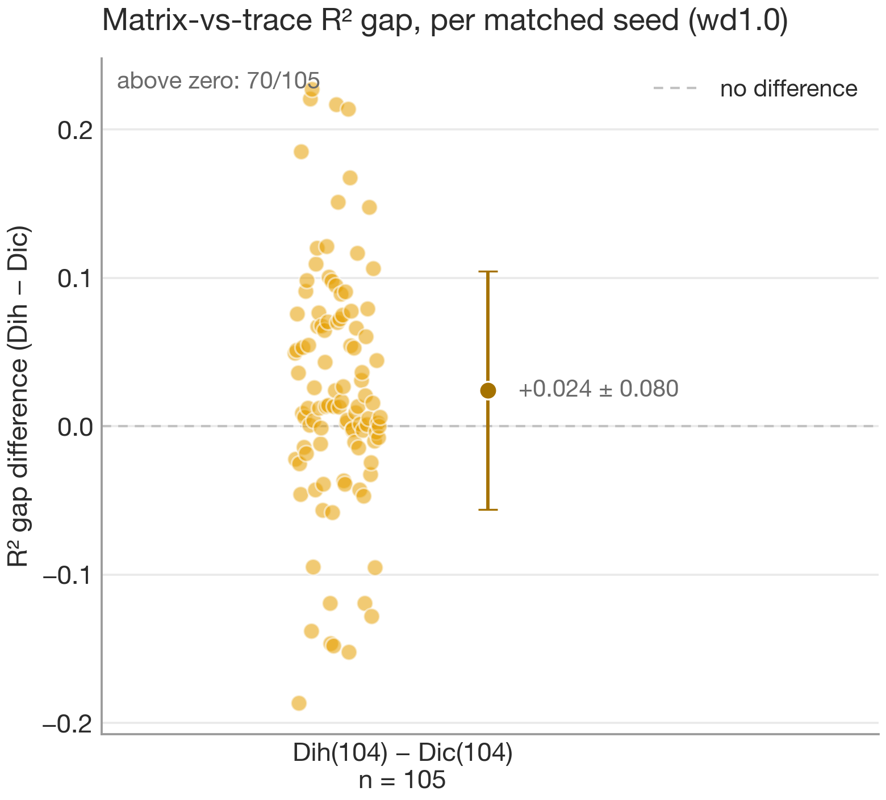

# Irreps vs cosets on a same-character-table pair: Dih(104) vs Dic(104)

> **Runs:** the order-104 sweep across 138 seeds, `runs/` (`pair-D52-*` and `pair-Dic26-*`, seeds 0–137) · **Figures + stats:** `uv run python scripts/pair_figures.py runs --wd wd1.0` · **Analysis code:** [`analysis/`](../src/finite_group_interp/analysis/)
>
> **Status: final at 138 seeds (weight decay 1.0).** The matrix-level and coset contrasts are taken on the **105 seeds where both groups grokked**; learnability is reported over all 138.

## Summary

Dih(104) and Dic(104) have **identical character tables** but different group structure — the dihedral group's 2-dimensional irreps are real, the dicyclic group's are quaternionic, and their subgroup/coset lattices differ. This is the smallest clean setting where character-level evidence runs out and the irreps-vs-cosets question has a real answer. Three findings across 138 seeds (105 matched seed pairs where both groups grokked):

1. **The pair separates on *learnability*.** Dih groks at 129/138 seeds, fast (mean ~22k epochs) and never stuck below generalisation; Dic groks at 112/138, much later (mean ~40k), and at 17 seeds stays stuck in pure memorisation — a robust difficulty asymmetry tracking the quaternionic structure.
2. **The coset hypothesis gains no independent support over irreps.** Coset-membership decodability, measured against the model's *own* irreps as the control, has a mean *excess* of about −0.05 across all proper normal subgroups and seeds — zero or negative. The naive probe hits 100% — but so does the irrep control, which is exactly what exposes the probe as vacuous.
3. **The matrix-vs-trace R² gap — the instrument built to detect the real/quaternionic difference — *does* separate the groups** (Dih 0.063 vs Dic 0.038, Welch p = 0.0019 at n = 105, Dih larger on 70/105). The earlier n = 27 null was underpowered; the larger sample resolves it into a real separation — but in the *opposite* direction to the prediction (a real irrep needs fewer free parameters, so the dihedral gap was expected to be smaller, not larger), and it stays correlational and unexplained.

The headline: on this pair, **cosets add nothing over irreps, but the readout does carry an unpredicted representation-type signature** — and the cleanest, most seed-stable discriminator is how *hard* each group is to learn. All three findings replicate on a fully-connected baseline (31 seeds/group), so they are not transformer artefacts — the coset-null in particular holds on the very architecture the coset account was originally read from.

## The question this pair can answer (and C₁₁₃ could not)

Two mechanistic accounts of group composition fit the published evidence: via the group's irreducible representations ([Chughtai et al., 2023](https://arxiv.org/abs/2302.03025)) and via coset/subgroup structure ([Stander et al., 2024](https://arxiv.org/abs/2312.06581)). Both bodies of evidence are character-level, and [report 01](01-c113-calibration.md) made the point that character-level evidence cannot separate them — C₁₁₃ is prime, so it has no subgroups and the coset account makes no prediction there.

Dih(104) and Dic(104) break that symmetry the right way. They share a character table, so any *character-level* instrument sees them as identical by construction; a calibrated instrument that nonetheless distinguishes them must be reading sub-character or subgroup-level structure — exactly the structure the two hypotheses disagree about. The dihedral group has a rich lattice of reflection subgroups; the dicyclic group has a unique involution and a quaternion-like lattice. If the model composes via cosets, the two should differ in coset decodability beyond what their (shared) irreps explain.

## Setup

- **Groups:** D52 = Dih(104) and Dic26 = Dic(104), both order 104, built from presentations (`scripts/run.py data.group=D52` / `Dic26`). They share a character table; their 2-dim irreps differ only in Frobenius–Schur type (real vs quaternionic).
- **Task / model:** identical to [report 01](01-c113-calibration.md) — predict a·b from (a, b) over all 104² pairs, 1-layer transformer, full-batch AdamW, deterministic CPU.
- **Sweep:** 138 seeds × weight decay {0.5, 1.0} × 80k epochs, `stop_on_grok`. The matched comparison uses **weight decay 1.0 only** — Dic is grok-fragile at 0.5 (memorises within budget), so it is not a clean matched setting.
- **Matched seeds:** the **105** wd-1.0 seeds where *both* groups grokked. Comparing groups only at matched (seed, wd) is the only honest way to attribute a difference to the group rather than the hyperparameters.
- **Order-matched contrast:** C13⋊C8 (order 104, *different* character table, dim-4 irreps) was run as a control. At the matched-pair data budget (train fraction 0.4) it **never groks**; a later sweep showed it *does* grok at higher train fractions — see [§ What this establishes](#what-this-establishes--and-what-it-cannot).

## What each hypothesis predicts

- **Irrep account:** the embedding concentrates in a few isotypic blocks (as calibrated on C₁₁₃); because the character tables are identical, this concentration looks the *same* for both groups at the character level. Any group difference must show in the *matrix-level* structure — the real-vs-quaternionic distinction the trace cannot see.
- **Coset account:** the model encodes coset membership for the group's subgroups, decodable from the residual stream *beyond* what the irreps explain, and differing between the two lattices.

The decisive measurements are therefore (a) the matrix-vs-trace **R² gap** (does the readout encode sub-character structure?) and (b) **coset decodability in excess of the irrep control** (is there a coset signal the irreps don't already provide?).

## Results

### Learnability: a robust, seed-stable asymmetry


This is the cleanest separator of the pair, and it does not require any post-hoc analysis of the weights.

- **Dih(104) groks at 129/138 seeds at wd 1.0**, fast: mean grok epoch **~22k** (median ~18.5k). The 9 non-grokking seeds are all *near-misses* (final test accuracy 0.88–0.99, just under the grok threshold) — **none** are stuck in memorisation. It also groks at wd 0.5.
- **Dic(104) groks at 112/138 seeds, only at wd 1.0, and much later:** mean grok epoch **~40k** (median ~37.7k), roughly twice as slow. Of the 26 that miss, **17 stay stuck in pure memorisation** (final test accuracy < 0.5, the lowest at 0.02). Every wd-0.5 Dic run failed to grok.

The quaternionic group is consistently and substantially harder to learn, and the *kind* of failure differs: the dihedral group always reaches near-perfect generalisation, while the dicyclic group frequently never leaves memorisation. This is a sub-character property — the two groups are character-identical — surfacing as a difference in *optimisation*, not in the structure of the solution once found.

### The coset side adds nothing over irreps


For each proper normal subgroup H, a linear probe reads coset membership of a·b from the residual stream, scored against two controls: a random-partition null (capacity floor) and an **irrep-feature reference restricted to the model's kept irreps** (the non-vacuous control — by Peter–Weyl, *all* irreps would trivially reconstruct everything, so the reference uses only the blocks the model actually uses).

Across all 7 proper normal subgroups × 105 matched seeds (735 measurements per group), the **mean `excess_over_irrep` is −0.058 (Dih) and −0.037 (Dic)** — zero or negative. The pattern is consistent and instructive: on the subgroups where the naive probe hits **100%**, the irrep control *also* hits 100%, so the excess is ~0. The probe's apparent success is fully accounted for by the irreps the model already computes; there is no coset signal on top. This is the control both prior papers lack, and it is load-bearing: without it, the 100% probe accuracy reads as strong coset evidence; with it, that evidence evaporates.

**The coset side does not separate the pair, and shows no mechanism independent of the irreps.**

### The matrix-level R² gap


The functional-form fit regresses the logits onto the matrix elements of ρ(a)ρ(b)ρ(c)⁻¹ (the `full` fit) and onto the trace χ = tr ρ alone (the `trace` fit). The **gap = full − trace** is the variance explained by sub-character structure the character cannot see — and since Dih and Dic share a character table, the gap is precisely where a matrix-level difference between them would appear.

At n = 105 matched seeds the gap **does** separate the groups:

```
D52 (Dih)   n=105  mean=0.063  std=0.061  median=0.043  range=[0.002, 0.217]
Dic26 (Dic) n=105  mean=0.038  std=0.050  median=0.014  range=[0.000, 0.163]
Welch t-test (Dih vs Dic): p=0.0019  => significant at alpha=0.05
Dih larger at matched seed on 70/105 (sign test p=0.0008); paired diff +0.024, 95% CI [+0.009, +0.039]
```

The earlier n = 27 null was underpowered (Cohen's d ≈ 0.32); the larger sample resolves it into a real, directionally-consistent separation. Three caveats keep it honest. The **direction is the opposite of the prediction** — a real irrep needs fewer free parameters, so the dihedral gap was expected to be *smaller*, not larger, and I have no representation-theory explanation for it. The effect is **modest and right-skewed**: it slips below p = 0.05 if the top ~10 dihedral seeds are trimmed, though the per-seed direction is robust (sign test p = 0.0008). And it is **correlational** — the gap is decodable, not shown used. It is *not* a grok-speed confound (gap vs. grok-epoch correlation ~+0.1).



### A caveat on the causal coset ablation

The coset analysis also reports a causal check — ablating the coset-direction subspace and measuring the increase in cross-coset error, against a matched random-partition subspace control ([commit `86856d5`](../src/finite_group_interp/analysis/coset_metrics.py)). That control matches the *capacity* of the ablated subspace but **not the irrep confound**: the coset subspace overlaps the irrep subspace the model needs, so the ablation excess is large and variable for *both* groups and does not separate them. The load-bearing coset result is therefore the **observational `excess_over_irrep`** above, not the ablation delta.

### The findings are not transformer artefacts


The coset hypothesis was originally read off fully-connected networks, so a transformer-only result leaves architecture as a stated confound. Re-running the pair on a one-hidden-layer FC network (shared embedding of a and b, concatenated into a single ReLU layer, no biases; 31 seeds per group at wd 1.0) reproduces all three findings:

- **Learnability asymmetry holds.** Dih groks at every seed, fast (mean ~5.7k epochs); Dic groks at every seed, ~3× later (mean ~15.8k). The ordering — quaternionic harder than real — is identical to the transformer's. One difference: on the FC every Dic seed *does* eventually grok, so the catastrophic memorisation-plateau failure mode seen on the transformer (17/138 stuck) appears to be transformer-specific; on the FC the asymmetry is purely a difference in *speed*.
- **Coset-null holds — on the very architecture that generated the coset hypothesis.** Mean `excess_over_irrep` is **+0.019 (Dih)** and **−0.016 (Dic)** across all 7 proper normal subgroups × 31 seeds; both centre on zero. Neither group shows a systematic coset signal beyond its own irreps.
- **Matrix-level R² gap separates the groups, more cleanly than on the transformer.** Dih mean 0.021 (± 0.011), Dic mean 0.012 (± 0.006), Welch **p = 0.0005**, Dih larger on 25/31 seeds — smaller magnitudes but a tighter separation, in the same unpredicted direction.

So the learnability asymmetry and the coset-null are architecture-general, and the representation-type signature in the matrix gap is, if anything, sharper on the fully-connected architecture the coset account was built from.

## What this establishes — and what it cannot

Established (138 seeds; matrix-level and coset at the 105 matched seeds):

1. **A learnability asymmetry** tied to the quaternionic structure: the character-identical dicyclic group is reliably harder to grok than the dihedral group, and fails in a qualitatively different way (memorisation plateaus vs near-misses). This is the most seed-stable result and neither account predicts it.
2. **No coset mechanism beyond the irreps** on this pair, under the irrep-restricted control that prior coset evidence omits.
3. **A matrix-level representation-type signature**: the matrix-vs-trace gap is larger for the real dihedral group than the quaternionic dicyclic one (p = 0.0019; replicated on the FC baseline at p = 0.0005). Real and directionally robust, but in the *opposite* direction to the parameter-counting prediction, correlational, and currently unexplained — a positive discriminating result, not a confirmation of the textbook irrep story.
4. **Architecture-generality of (1)–(3).** All three replicate on a fully-connected baseline (31 seeds/group) — including the coset-null *on the architecture the coset account was originally read from*. The findings are not transformer artefacts.

Not established:

- **Generality beyond dim-2 irreps.** The whole pair lives in 2-dimensional blocks, where the gap has the least room. A preliminary single-group sweep on larger irreps — C₁₃⋊C₉ (order 117, dim-3) and C₁₃⋊C₈ (order 104, dim-4) — shows both **do** grok, reliably at higher train fractions (≥ 0.7) and not at lower ones, with weight decay mattering little. So the earlier "C₁₃⋊C₈ never groks" was a data-budget artefact, not a ceiling. These runs are too few to pin down the boundary, and the matrix contrast at dim ≥ 3 is left to follow-up work.
- **The dim-5 regime.** The Heisenberg group over F₅ (order 125, dim-5 irreps) did **not** grok at the base setting (1M epochs) or under a small weight-decay × train-fraction probe (best test accuracy ~0.15). The likely limit is model *width*, not data: a 5-dim irrep occupies a 25-dim isotypic block and d_model is only 64, room for at most two of the four such blocks. This is an untested hypothesis — the probe varied data and regularisation, not width — so the dim-5 matrix contrast remains out of reach for now.

## Next

- **Secondary pair, dim-5:** Heisenberg/F₅ vs C₂₅⋊C₅ — same character table, far richer matrix structure, where the R² gap would have the most room to speak. The Heisenberg go/no-go did not grok, likely width-bound (see above), so reaching this regime needs a wider model before the matrix contrast can be run.

## Reproduce

```bash
uv sync
# train the pair across seeds (parallel local sweep; env-overridable):
GROUPS=Dic26,D52 SEEDS=0-137 uv run python scripts/sweep_parallel.py
# cross-seed figures + stats (learnability, matrix-level R² gap, coset excess):
uv run python scripts/pair_figures.py runs --wd wd1.0 --out docs/figures
# fully-connected baseline (architecture confound): same pair, FC architecture
GROUPS=Dic26,D52 SEEDS=0-30 ARCH=fc uv run python scripts/sweep_parallel.py
uv run python scripts/pair_figures.py runs/<date> --arch fc --out docs/figures
```
